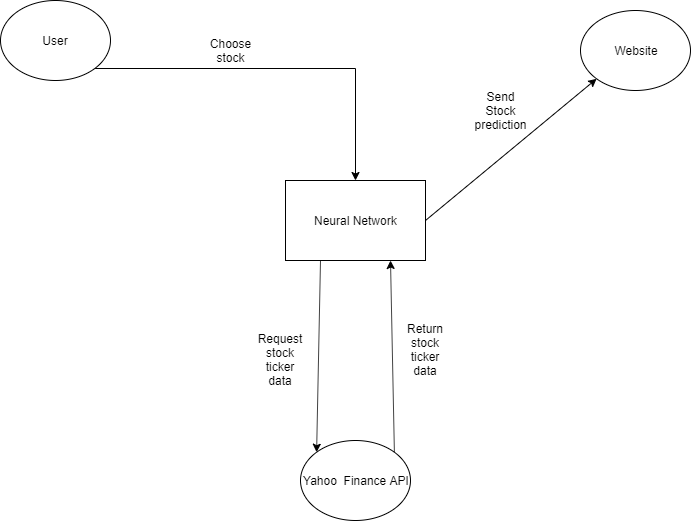
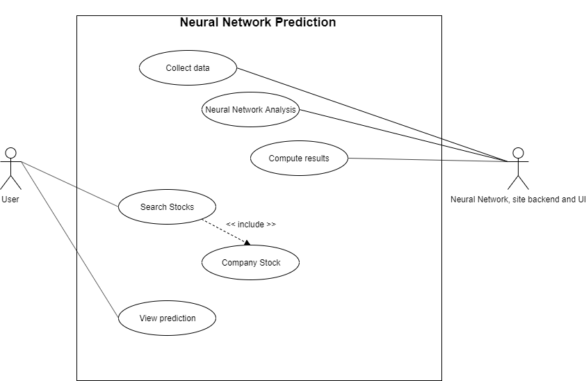
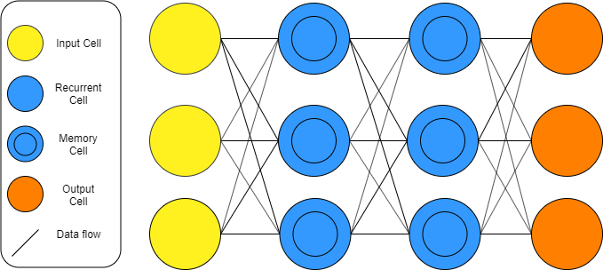
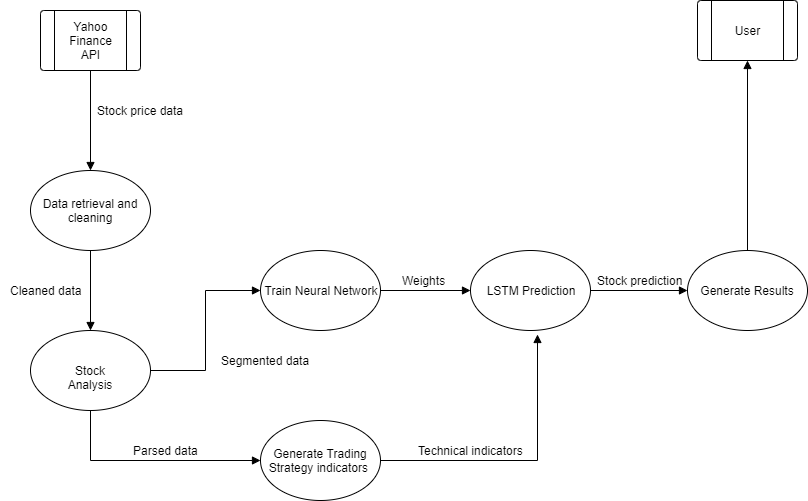
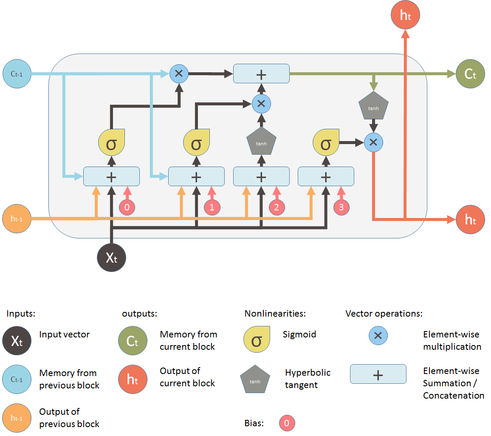
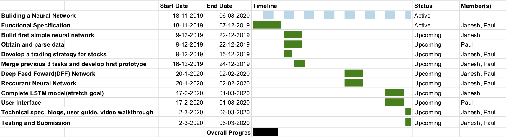

## Table of contents

*1. Introduction 1.1 Overview 1.2 Business Context. 1.3 Glossary*

*2. General Description 2.1 Product / System Functions 2.2 User Characteristics and Objectives 2.3 Operational Scenarios 2.4 Constraints*

*3. Functional requirements 3.1 Gathering Data 3.2 Data Segmentation 3.3 Neural Network Training 3.4 Long Short Term Memory(LSTM) prediction 3.5 Display networks predictions for the user*

*4. System Architecture 4.1 Context Diagram 4.2 Use case diagram 4.3 Use case description 4.4 Neural Network overview*

*5. High-Level Design 5.1 Dataflow Diagram 5.2 LSTM Neural Network Design*

*6. Preliminary Schedule - Gantt chart*

*7. Appendices*

1. #### **Introduction**
  
   **1.1 Overview**
   
   Our project is based around building a neural network with the end goal of building a LSTM(Long short-term memory) model. Stock prediction will be used purely as a means to test our neural network. LSTM has memory cells, by having the extra element of long-term memory, the network has data about the data in prior layers as memory which allows the model to find the relationships between the data itself. We will use a trusted data set (one that is already labelled with ground truth) so it can be used for training. The stock data will be acquired by using a python API and  will be converted into a a data frame using the Pandas library. The model will know how to forecast the future direction of the stock prices by using a trading strategy. On the user interface the data will be represented as a graph, with the stock prediction line in blue and the actual stock price in red to allow you to visually compare how accurate the neural network. There will also be a percentage accuracy. 
   
   **1.2 Business Context**
   
   The neural network can be used by individuals who trade stocks regularly. 
   
   **1.3 Glossary**
   
   * LSTM -  _Long short-term memory(LSTM) is an artificial recurrent neural network architecture used in the field of deep learning._
   * Pandas -  _Pandas is a software library written for the Python programming language for data manipulation and analysis._
   * API - _An application programming interface is an interface or communication protocol between different parts of a computer program intended to simplify the implementation and maintenance of software._
   * Ticker - _A unique shorthand symbol representing a stock e.g Tesla has ticker symbol "TSLA"_
   
2. #### **General Description**
  
   **2.1 Product/System Functions**
   
   The function of this product is to use LSTM neural network architecture to predict the future direction of stock prices to assist the user/trader on when to buy or sell. The user interface will allow the user to pick a stock, choosing from a past date until the current date and time all the data on a readable graph for the user to interpret .
   
   **2.2 User Characteristics and Objectives**
   
   We expect our users to be computer literate and well adapted to technology, we will mainly have two types of users, they users with an understanding of neural networks and how they work. And the others will be experienced stock traders who are capable of reading and understanding the data that will be displayed on a graph on the user interface as most of the user interaction will be with the graph. We aim to build a user interface that will provide a seamless experience for the user. 
   
   **2.3 Operational Scenarios**
   
	* **_User Stock selection_**
	   Users will be presented with a search box by which then can type the ticker name of a stock.
	
	* **_User date selection_**
	   Users will be asked to input the start and end date that will be used in the stock prediction.

	* **_User prediction confirmation_**
	   The system will only attempt to download and predict the future stock price after the User has selected the "predict" button. if the selected stock or dates are not available an appropriate error message will be displayed.

	* **_Graph Generation_**
	   The system will only generate a graph comparing the real and predicting line after the user has clicked the predict button and the results have successfully completed.

	* **_Accuracy metrics_**
	   The system will display the accuracy details of the prediction vs the real outcome only after the graph has been generated.

  **2.4 User Characteristics and Objectives**
  
  * **Time constraints**
  
    As the due date for the project is Friday 6/3/2020 we must perform the development and testing of this project in a limited amount of time. Additionally there is another time constraint, we need to ensure that the prediction is performed in a reasonable amount of time so we must make sure that it is as efficient as possible.
  
  * **Hardware constraints**
  
    The prediction will take some time to complete so we need to maximize the User hardware resources, to do this will offload most of the work from the CPU to the GPU if available to drastically increase the prediction time.
  
  * **Data constraints**
  
    It may be difficult to source a trusted and accurate data set available to us in order to train the neural network.
  
     	 

3. #### **Functional Requirements**

   **3.1 Gathering Data**

   * Description - The first thing that needs to be done is gather the stock data The data will be retrieved by using a python API(Yahoo finance API).
   * Criticality - This is critical, without any data the neural network cannot function.
   * Technical Issues - Deciding how often to gather and update the data.
   * Dependencies with other requirements - None.

   **3.2 Data Segmentation**

   * Description -  After the data is gathered from the Yahoo finance API it will be then be segmented and converted into a data frame using a python library called pandas.
   * Criticality - This is critical, this is essential for grouping the data needed for the network from the data collected from the API.
   * Technical Issues - Have to make the right data that is needed for the network is segmented.
   * Dependencies with other requirements - This functionality is dependent on gathering data.

   **3.3 Neural Network Training**

   * Description - This involves training the network using a chosen trusted dataset to make the neural network as accurate as possible, the dataset for training will be important for updating the model weights. The trading strategy will search through possible values for the neural network model weights in order to find a set of weights that results in good performance on the training dataset.
   * Criticality - This is critical for the success of the neural network's predictions.
   * Technical Issues - Figuring out how to choose what weights to use.
   * Dependencies with other requirements - Depends on data gathering and data segmentation.

   **3.4 Long Short Term Memory(LSTM) prediction**

   * Description - This lstm node keeps tracks of a large number of previous outputs so that it can be reused in the next time steps input
   * Criticality -  this is very critical as without the lstm node the neural network would be a standard recurrent neural network model which would only be able to remember a few of the previous outputs which would greatly affect the neural networks prediction capabilities as patterns are easier to discern in stock price fluctuations over a longer time frame which the lstm node would provide.
   * Technical Issues - LSTM models can be quite complicated to build.
   * Dependencies with other requirements - Depends on neural network training.

   **3.5 Display networks predictions for the user**

   * Description - On the user interface the data will be represented as a graph, with the stock prediction line in blue and the actual stock price in red to allow you to visually compare how accurate the neural network is.
   * Criticality - Critical as it is how the user views the neural network's work and prediction.
   * Technical Issues - We will create an easy to use, user friendly web interface that allows users from all backgrounds to easily access it. To accomplish this we will make a clean and minimalist web page with all essential information easy to locate and view to ensure we cater to as many users as possible.
   * Dependencies with other requirements - The graph displayed for the user depends on the LSTM prediction.

   

4. #### **System Architecture**
   **4. 1 Context Diagram**
   A system context diagram is a diagram that defines the boundary between the system, or part of a system, and its environment, showing the entities that interact with it.

   

   

   

   

   

   **4.2 Use Case Diagram**
   A use case diagram at its simplest is a representation of a user's interaction with the system that shows the relationship between the user and the different use cases in which the user is involved.

   

   ##### **4.3 Use case description**
   * **Use case name**: Collect data
     _Description_ - Stock data is collected from the Yahoo Finance API in a .csv file type. 

   * **Use case name**: Neural Network Analysis
     _Description_  - The Neural Network is instantiated and given the collected stock data to train on and compute a stock prediction.

   * **Use case name**: Compute Results
     _Description_ - The mean loss formula is applied to the prediction result comparing it to the original stock as a measure of accuracy and both the prediction line and actual stock price line is drawn on a graph to visually show the differences.

   * **Use case name**:  Search Stocks
     _Description_ - The User searches through the list of available stock provided by the Yahoo Finance API.

   * **Use case name**: Company Stock
     _Description_ - This is an extension on Company Stock, it includes the stock ticker symbol.

   * **Use case name**: View Prediction
     _Description_ - The results are drawn back to the website to allow the user to compare and contrast the results.

   **4.4 Neural Network Overview**
   In the diagram below data flows from the input cell to the recurrent cell, within these cells is a memory cell, this is the defining characteristic of an LSTM neural network, standard recurrent neural networks have the ability to remember output from a few iterations ago but LSTM neural networks can remember output from many iterations ago thanks to its memory cell, this allows the neural network to make better predictions where the previous data heavily influences the next such as stock price data.
    

5. #### High-Level Design

   **5.1 Data flow Diagram**:
   A data flow diagram or DFD represents the flow of data of a process or system. The DFD provides information about the outputs and inputs of each entity and the process itself.

   

   **5.2 LSTM Neural Network Design**

   The image below outlines how data flows from the starting input of the input vector Xt to the output of ht and how the previous outputs ht-1 and ct-1 are reused to influence the next output of the neural network.
   
   **Reference**: [Understanding LSTM and its Diagrams](https://medium.com/mlreview/understanding-lstm-and-its-diagrams-37e2f46f1714)

6. #### **Preliminary Schedule**

   Our project plan is displayed in the form of a Gantt chart below, it shows each task that has to be undertaken before the product is fully complete. Each activity is represented by a bar, the position and length of this bar reflects the start date, duration and the end date of each activity. On the right side of the Gantt chart it shows the status of each task as either active, upcoming or completed. It also shows which group member or member has been assigned to carry out a particular task.

   

7. #### **Appendices**

   Resource:

   Explanation of recurrent neural networks and Long short term memory - https://towardsdatascience.com/understanding-rnn-and-lstm-f7cdf6dfc14e