## Table of contents

_1. Introduction 1.1 Overview 1.2 Glossary_

_2. System Architecture 2.1 Language choice 2.2 Context Diagram_

_3. High-Level Design 3.1 Data flow Diagram 3.2 Feed-Forward Neural Network Design 3.3 Recurrent Neural Network Design 3.4 LSTM Neural Network Design_

_4. Problems and Resolution 4.1 Vanishing gradient problem 4.2 Normalization_

_5. Testing 5.1 Neural Networks Test 5.2 Normalization Test 5.3 Error Test_

_6. Installation Guide_

_7.References_

1. #### Introduction

   **1.1 Overview**

   Our project is based around building a neural network with the end goal of building a LSTM(Long Short-term memory) model from scratch. We started with a simple feed-forward neural network and built on to it to make a recurrent neural network and finally building long short term memory neural network. Stock prediction is used purely as a means to test our neural network.

   

    In a simple neural network, the first layer is the input layer, here the input is passed into the Neural Network and is prepared to be processed in the second layer, the hidden layer. This is where most of the neural network algorithm occurs. Here the input data is changed in slight ways, these slight changes, change the outcome in the output layer. This process of slightly changing the input data is repeated to find the most desirable outcome.

   

   LSTM has memory cells, by having the extra element of long-term memory, the network has data about the data in prior layers as memory which allows the model to find the relationships between the data itself. 

   

   The stock data is acquired by using a python API and is converted into a data frame using the Pandas library. The model knows how to forecast the future direction of the stock prices by using the weights changed by back propagation during the training stage of the neural network. During the training stage the data is passed through the network by forward propagation, forward propagation in simple terms is when the input X provides the initial information that then propagates to the hidden units at each layer and finally produces the output y^. In the feed-foward and recurrent neural network the data is passed from the input through the hidden layer (A hidden layer in an artificial neural network is a layer in between input layers and output layers where artificial neurons take in a set of weighted inputs and produce an output through an activation function) and an output (prediction) is produced. The errors from the outputs in the training cycles are used to adjust the various weights through back propagation through the network. On the website we made to display the networks training and testing output, the data is represented on a graph, with the actual stock price in blue and the stock prediction for the training data in orange and the stock prediction for the testing data in green to allow you to visually compare how accurate the neural network is. There is also a percentage accuracy shown using the mean absolute percentage error (mape) for the testing data prediction.

   **1.2 Glossary**

   * Feed-Forward Neural Network - *In this network, the information moves in only one direction, forward, from the input nodes, through the hidden nodes and to the output nodes. There are no cycles or loops in the network.*

   * Hidden Nodes - *Located in the hidden layer of a neural network and activation functions are applied on them.*

   * Recurrent Neural Network - *a class of artificial neural networks where connections between nodes form a directed graph along a temporal sequence. This allows it to exhibit temporal dynamic behavior*

   * LSTM - *Long short-term memory(LSTM) is an artificial recurrent neural network architecture used in the field of deep learning, it is a modified* *version of recurrent neural networks, which makes it easier to remember past data in memory. The vanishing gradient problem of RNN is resolved here.*

   * Pandas - *Pandas is a software library written for the Python programming language for data manipulation and analysis.*

   * API - *An application programming interface is an interface or communication protocol between different parts of a computer program intended to simplify the implementation and maintenance of software.*

   * Ticker - *A unique shorthand symbol representing a stock e.g Tesla has ticker symbol "TSLA"*

   * Back propagation *-* *is an algorithm for supervised learning of artificial neural networks using gradient descent. Given an artificial neural network and an error function, the method calculates the gradient of the error function with respect to the* neural network's *weights.*

   * Pandas Dataframe - *A* *two-dimensional size-mutable, potentially heterogeneous tabular data structure with labeled axes (rows and columns).*

   * Sigmoid function -  *Type of activation function Squashing functions limit the output to a range between 0 and 1, making these functions useful in the prediction of probabilities*

   * Tanh function - A rescaling of the logistic sigmoid, such that its outputs range from -1 to 1. 

2. #### System Architecture

   In this section we discuss our language choice for this project and show a context diagram to display our system and the entities.

   **2.1 Language choice**

   We chose to use python3 for this project. Python has several libraries that were essential to the success of this project, in particular pandas and numpy were critical in this project. Pandas is used to convert the stock data into a pandas data frame and makes it much easier to parse and access specific data. Numpy is a python library that gives support for large, multi-dimensional arrays and matrices, along with a large collection of high-level mathematical functions to operate on these arrays. This was very usual when building the neural networks as it saves a lot of time as we can multiply numpy arrays and matrices without having to write the code for it.

   **2.2 Context Diagram**

   This system context diagram defines the boundary between the system and its environment, showing its entities. The system developed consists of a neural network and a website and the neural network runs and gives its prediction which is shown on a graph on the website.

   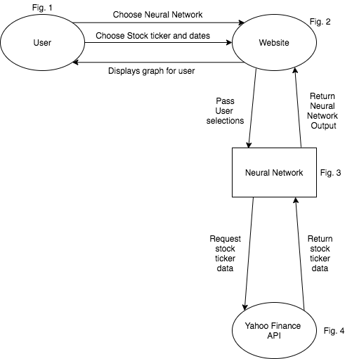

   The following entities are shown in the system context diagram:

   * User(fig.1): The user identifies which neural network variation they want to run and also select a stock for it to predict.

   * Yahoo Finance API(fig.4): The yahoo finance API retrieves and returns the relevant stock data.

   * Neural Network(fig.3): The neural network runs, it first trains and updates its weights before the test data is inputed.

   * Website(fig.2): The website displays a graph showing the actual stock price, training prediction and testing prediction. It also shows the mean absolute percentage error for the testing prediction.

3. #### High-Level Design

   **3.1 Data flow diagram**

   A data flow diagram or DFD represents the flow of data of a process or system. The DFD provides information about the outputs and inputs of each entity and the process itself.

   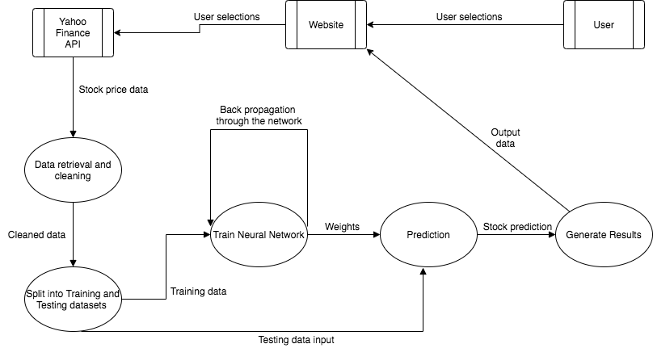

   **3.2 Feed-Forward Neural Network Design**

   The image below outlines how data flows from the starting input of the input X to the output of Y of the neural network.

   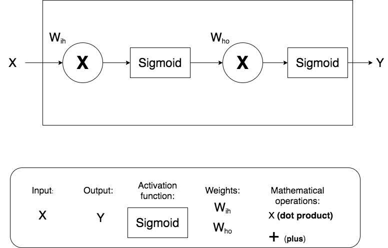

   **3.3 Recurrent Neural Network Design**

   The image below outlines how data flows from the starting input of the input Vector Xt to the output of yt and how the previous hidden states at-1 is reused to influence the next output of the neural network.

   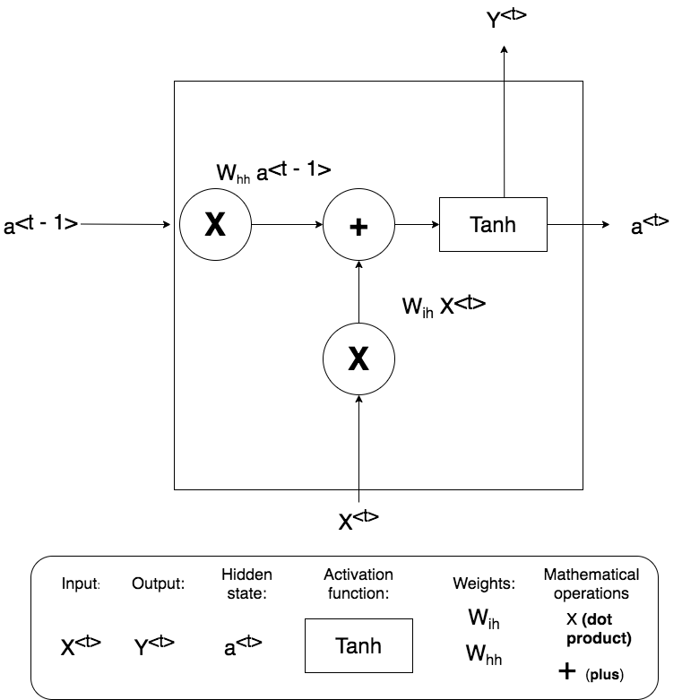

   **3.4 LSTM Neural Network Design**

   As already mentioned before the vanishing gradient problem of RNN is resolved in the LSTM model, it trains the model by using back-propagation. In an LSTM network, three gates are present:

   * Input gate - discover which value from input should be used to modify the memory. Sigmoid function decides which values to let through 0,1.0 and tanh function gives weightage to the values which are passed deciding their level of importance ranging from-1 to 1.
   * Forget gate - discover what details to be discarded from the block. It is decided by the sigmoid function, it looks at the previous state(ht-1) and the content input(Xt)
   * Output gate - he input and the memory of the block is used to decide the output. Sigmoid function decides which values to let through 0,1.0 and tanh function gives weightage to the values which are passed deciding their level of importance ranging from -1 to 1 and multiplied with output of Sigmoid.

   The image below outlines how data flows from the starting input of the input matrix Xt to the output of ht and how the previous outputs ht-1 and ct-1 are reused to influence the next output of the neural network. 

   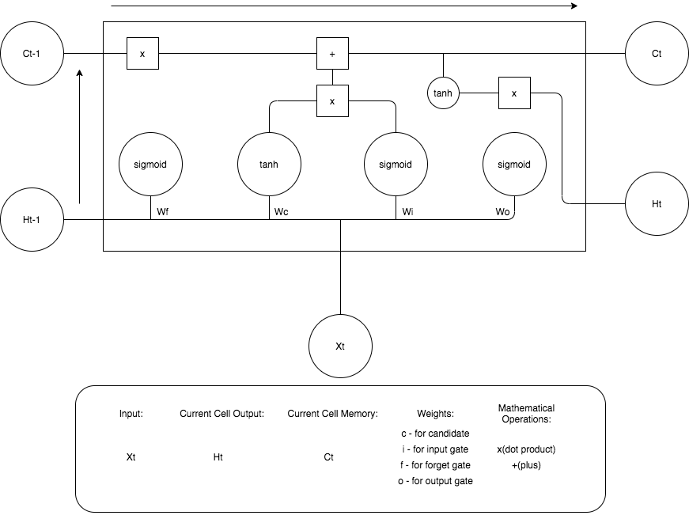

4. #### Problems and Resolution

   **4.1 Vanishing Gradient Problem**

   * **Problem**

     The vanishing gradient problem occurs in an RNN due to the gradients becoming very small during backpropagation, this is mainly due to the use of activation functions which squash values into a narrow space, for example the sigmoid function is an activation function which squashes all its’ input values into a range of [0, 1]. Eventually these gradients become so small that a big change in the input results in only a very small change in the output as seen in the image below.

     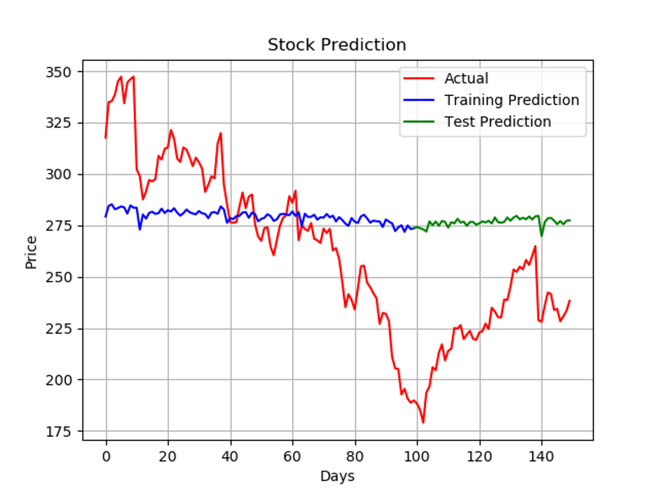

   * **Solution 1**

     To solve this problem in the RNN we used gradient clipping, this involved clipping the gradients when it exceeded a minimum number and setting it to that predefined minimum value, this solved the vanishing gradient problem as seen in the RNN output of the image below.

     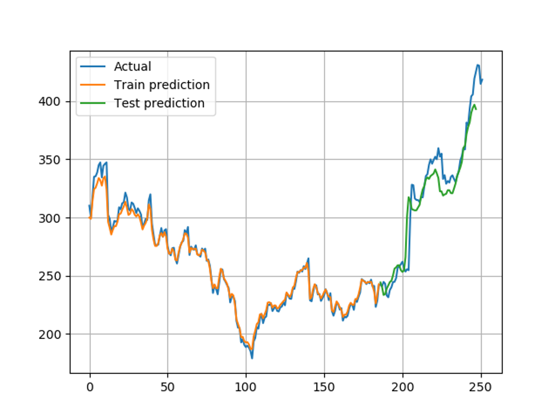

   * **Solution 2**

     This problem was completely solved by developing an LSTM. An LSTM has gates which control the flow of information throughout the network. One of these gates is called a forget gate and decides what information the network should forget and keep. This forget gate in combination with the cell state allows the network to update parameters in such a way as to not tend to zero significantly decreasing the likelihood of a vanishing gradient problem. The LSTM solved the vanishing gradient problem as you can see in the image below.

     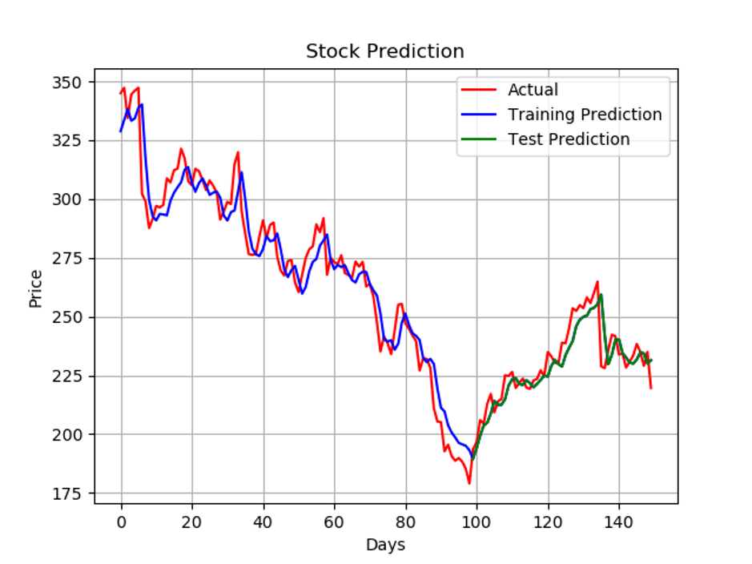

   **4.2 Normalization**

   * **Problem 1**

     In the beginning we would split the training and test data, then normalize each set of values differently, this led to the same training accuracy, but in the testing phase the resulting graph would show the line pushed down significantly but still following the ups and downs of the original data as seen below. 

     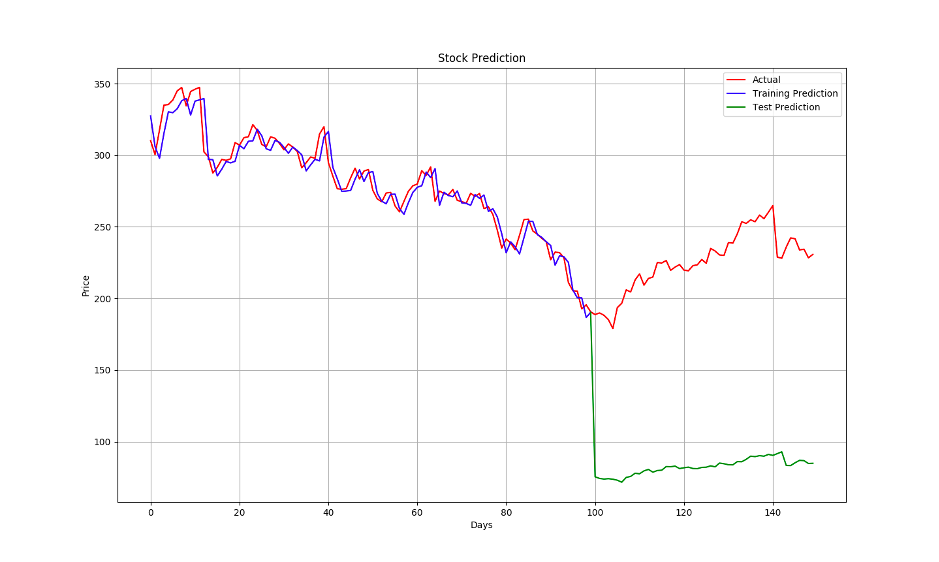

     This was due to the way the weight matrices had been trained on different normalized data. The weight values would be too low, causing the test input data values to be decreased significantly.

   * **Problem 2**

     We also ran into issues in the value we would use to normalize the data. Originally we would just use the maximum value in the data to normalize in a range of 0 to 1. We then discovered that some neural networks would perform better if we normalized by a different value. We normalized by appending zeros to a 1 for the length of the max rounded value + 1 e.g. if max is 5, length is 1, so normalizing value is 1 + 0 * length = 1 + 0 * 1 = 10, if max is 100, normalizing value is 1000, if max is 9999, normalizing value is 10000, etc. Later we found that this caused some neural networks to perform significantly worse on stocks where it had previously performed well.

   * **Problem 3**

     Additionally, we ran into assertion errors when testing if the denormalized data is equal to the original no matter what normalization technique we used as mentioned above.
     For example:
     If you run the following python code below:

     <code>original = 13</code>

     <code>normalized = original / 99</code>

     <code>denormalized = normalized * 99</code>

     <code>print(original, normalized, denormalized, sep="\n")</code>

     After running you would expect the denormalized data to be exactly equal to the original as you are dividing and multiplying a value by the same number(13 / 99 * 99), but in this case the denormalized data = 13.000000000000002 when the correct value is 13.0.

     This is due to the way python decimal floating-point numbers are  approximated based on the binary floating-point numbers actually stored in the machine.

   * **Solution 1**

     The solution was simple yet it took a while to solve, we just normalized all the data in the beginning so they are all normalized in the same way i.e. a global normalisation.

   * **Solution 2**

     We decided to return to the original normalizing technique of using the max value as it did not possess any of these issues.

   * **Solution 3**

     To solve this problem we ensured that if the denormalized and original data are not exactly equal, they are at least equal up to 12 decimal places. This is an extremely small number so it does not affect the outcome at all, especially since the computation is only performed once.

5. #### Testing 

   Testing was performed for all important aspects of the Neural Network for which an error could skew results.

   **5.1 Neural Networks Test**

   To ensure the Neural Network was working correctly we created a test for each Neural Network to ensure it could predict a straight horizontal line with high accuracy.We chose this problem as it is relatively simple and should be easily solvable by a Neural Network. Every Neural Network which includes the Feed Forward, RNN and LSTM performed very well on this test, achieving a training accuracy of 99.99% and a minimum testing accuracy of 97%. This test was run after any change was made to code of any Neural Network to ensure it still performed well on the basic task of predicting a straight line.

   **5.2 Normalization Test**

   We ensured all data was normalized in a range of 0 and 1 and checked that after denormalizing, the data was reverted back to the original values. This was an important test as an error here could significantly skew results if by a large enough value.

   **5.3 Vanishing Gradient Test**

   To evaluate the accuracy of our model we used error testing functions such as MSE (Mean Squared Error), RMSE (Root Mean Squared Error), MAPE (Mean Absolute Percentage Error). We ensured that if the two values are the same, the MAPE error would return an error of 0.0% indicating 100% accuracy as it should. Although not part of a test we validated the error returned by our functions against a calculator using their original mathematical formula to ensure correct results for different sets of values.

6. #### Installation Guide 

   This section contains a step by step software installation guide. Including a detailed description of the steps necessary to install all required software.

   1. **Install Python 3**

      If you already have Python version 3.8.1 or greater you can skip this step.

      

      If you have a linux Ubuntu system open a terminal and enter the commands below:

      1. <code>sudo apt-get update</code>

      2. <code>sudo apt-get install python3.8.1</code>

      3. Go to step **2. Install packages**

         

      Head over to the Python3 website at https://www.python.org/downloads/

      **From the list of downloads:**

      1. Click the link which says “Python 3.8.1” as highlighted in green in the image below.

         

      2. Scroll down to the bottom of the page until you reach the file section as seen in the image below.

         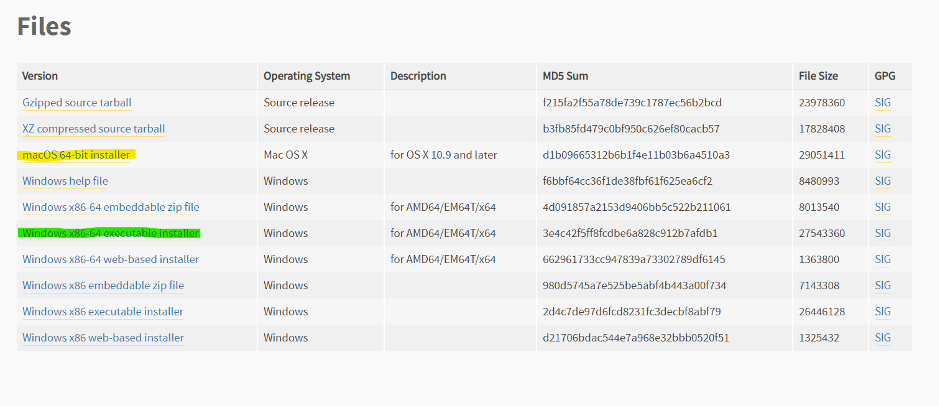

      3. If windows:

         Click the file that says <code>Windows x86-64 executable installer</code> as highlighted in green in the image above.
         If macOS:

         Click the file that says <code>macOS 64-bit installer</code> as highlighted in yellow in the image above.

      4. Once the installer has finished downloading, click on the file and follow the Python installer instructions.

   2. **Install Packages**

      1. Simply download or clone the gitlab repository at: https://gitlab.computing.dcu.ie/mcnallp5/2020-ca326-pmcnally-buildinganeuralnetworktopredictstockprices

         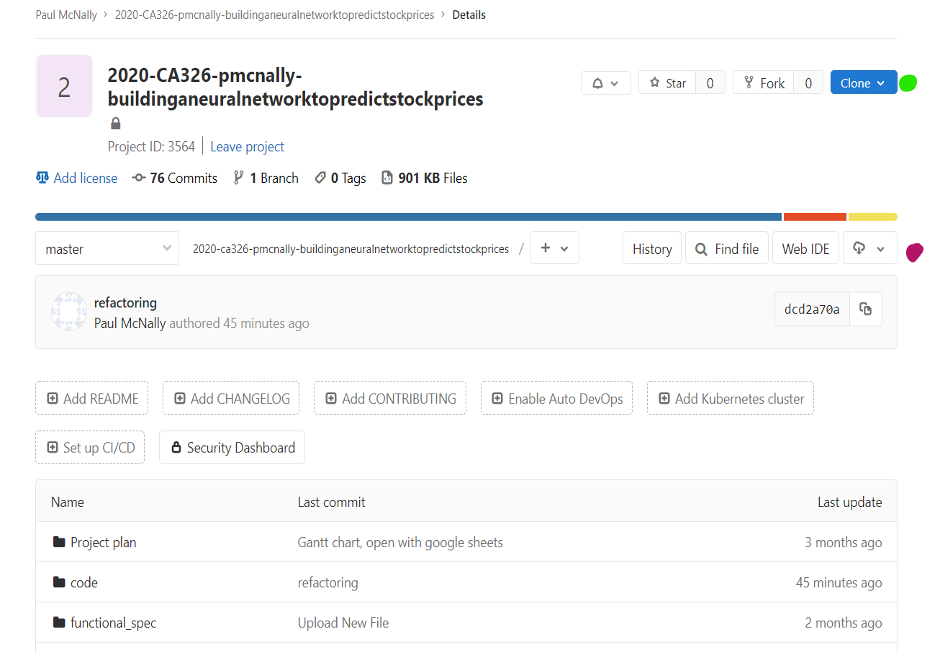

         To Download:

         * Click the cloud button to the left of the purple circle in the image above
         * Click on the button titled “zip”
         * Open the file once downloaded
         * Extract the file

         To Clone:

         * Click the blue button titled “clone” next to the green circle in the image above   
         * Copy the <code>Clone with HTTPS</code> url to clipboard.
         * Open up a terminal
         * Enter the command below pasting in the url you copied above between the quotation marks: <code>git clone “url “</code>

      2. Open up a terminal and cd into the code directory of the repository.

      3. Enter the command below:

         <code>pip3 install -r requirements.txt</code>

      All of the necessary software packages to run the project are now installed.

7. #### References

   Python Pandas library: https://pandas.pydata.org/Python

   Numpy library: https://numpy.org/

 