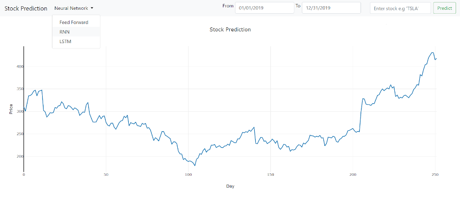
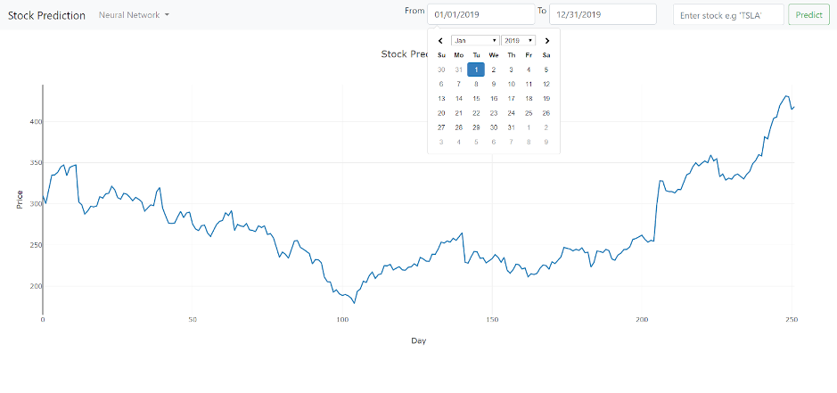
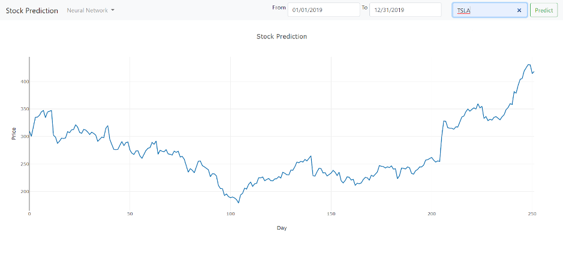
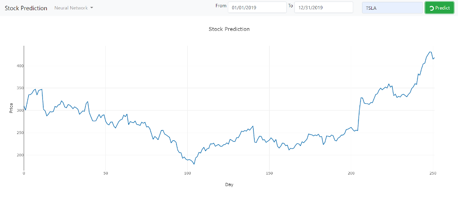
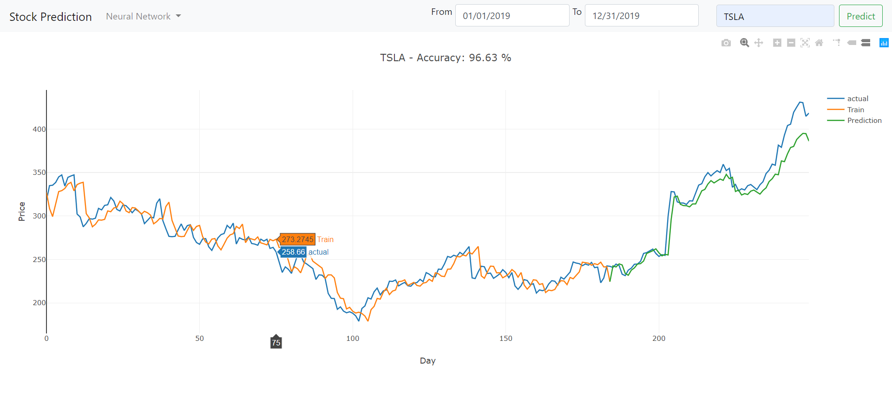

## Table of contents

_1. Installation guide check_

_2. How to run website_

_3. How to use website_

_4. How to run python files from terminal_

1. #### Installation guide check

   Before proceeding please ensure you have completed all the relevant steps set out in the installation guide in the technical specification to be able to run and use the software.

2. #### How to run website

   1. Open a terminal

   2. Cd into the code/Website directory

   3. If Windows enter the command below:

      <code>app.py</code>

      If macOs or Linux enter the command below:

      <code>python3 app.py</code>

   4. Open a browser

   5. In the url type "localhost:3000"

   6. Click Enter

   This website should now be displayed on screen.

3. #### How to use website

   1. Click the Neural Network button in the top left of screen as shown in the image below.

      

   2. Select a Neural Network to use for the prediction.

   3. Click on the dates boxes located next to the “from” and “to” text and select a valid date range as shown in the image below.

      Note : you may also type the date within the box in the following format “mm/dd/yyyy”

      

   4. Enter a valid ticker in the search box as shown in the image below:

      

   5. Click the predict button

      The button will now display a loading icon within it to indicate that the Neural Network is processing as shown below:

      

   6. Once the loading icon fades, the results will be updated on the graph as shown in the image below.

      

      

   

4. #### How to run python files terminal

   In addition to using the website above you may also run each of the python files listed below separately by navigating to the code directory in a terminal and entering the command beside the name of the file you wish to run into the terminal.

   Note : the windows commands are just the name of the file.

   Files:						                              macOS/Linux command:

   1. FeedFoward_main.py                  <code>python3 FeedForward_main.py</code>
   2. RNN_main.py                                <code>python3 RNN_main.py</code>
   3. LSTM_main.py                              <code>python3 LSTM_main.py</code>